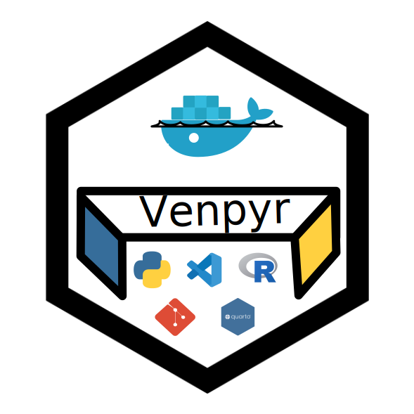

# venpyr 

<!-- badges: start -->

<!-- badges: end -->
Docker image for Data Science projects in Python and R.

## Get the Image

You can pull the `venpyr` image from DockerHub:

```shell
docker pull timabg/venpyr
```

## Content

`venpyr` does contain the following tools for your Data Science project:

- 🐍 __Programming language__: Python (3.10), R (4.3.1).
- 📖 __Documentation__: Quarto (1.5.57).
- 🧩 __Package manager__: uv (0.5.13).
- ⏲ __Versioning__: Git.
- ✨ __VScode facilities__: basic extensions and settings (devcontainer.json, settings.json).

## About

`venpyr` is a basic Docker image for coding in Python/R in Data Science projects. 
It is adapted from `Rocker` (official Docker image for R) including additional tools for project management such as `Git` and `uv`. 
